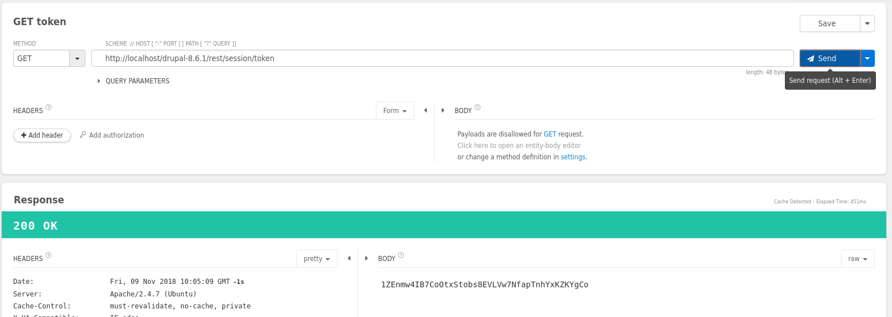
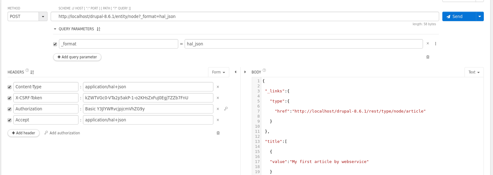

1.- Log in en la aplicación con el usuario que queramos hacer la petición.

2.- Desde Restlet-Client -> http://localhost/drupal-8.6.1/rest/session/token

3.- Desde Restlet-Client -> http://localhost/drupal-8.6.1/rest/session/token

